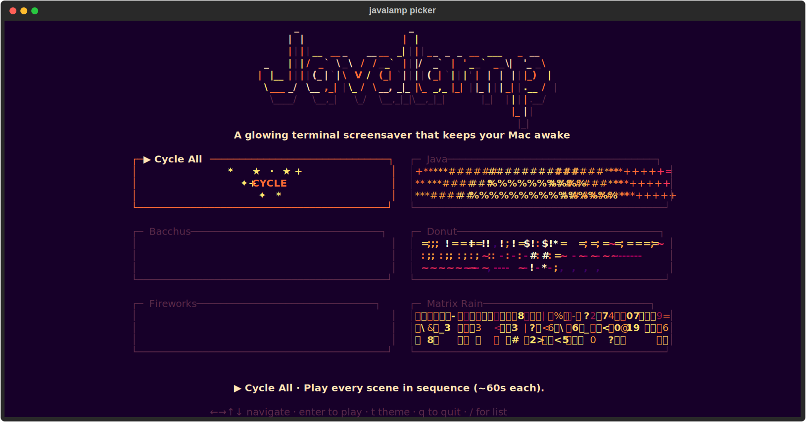
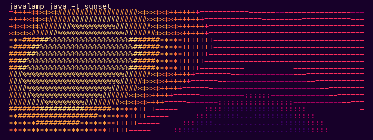

# javalamp

A glowing terminal screensaver that keeps your Mac awake.



## Demo



## Install

From this repo:

```sh
make install
javalamp
```

After the PyPI release:

```sh
pipx install javalamp
javalamp
```

Requires Python 3.10+ and [pipx](https://pipx.pypa.io/). On macOS:

```sh
brew install pipx
```

## Run

```sh
javalamp              # open the scene picker
javalamp java         # play the Java scene
javalamp matrix       # play one scene directly
javalamp --cycle      # rotate through every scene
javalamp -l           # list scenes
```

While the picker or a scene is running:

```text
arrows  navigate
enter   play
t       cycle theme
q       quit
```

## What It Does

- Runs animated ASCII scenes in your terminal.
- Defaults to the warm `sunset` theme.
- Keeps your Mac awake with `caffeinate -d -i` while running.
- Restores your terminal cleanly when you quit.
- Lets you add custom scenes in `~/.config/javalamp/scenes/`.

Disable the macOS sleep guard when you want:

```sh
javalamp --no-caffeinate
```

## Develop

```sh
python -m venv .venv
source .venv/bin/activate
pip install -e ".[dev]"
pytest
```

Useful repo shortcuts:

```sh
make reinstall  # update the global command after editing
make test       # run tests
make list       # list scenes
```

Regenerate README media:

```sh
PYTHONPATH=src python scripts/render_readme_assets.py
```

## Custom Scenes

```sh
javalamp new-scene lava
javalamp check-scene lava
javalamp lava
```

See [SCENE_GUIDE.md](SCENE_GUIDE.md) for the tiny scene API.
